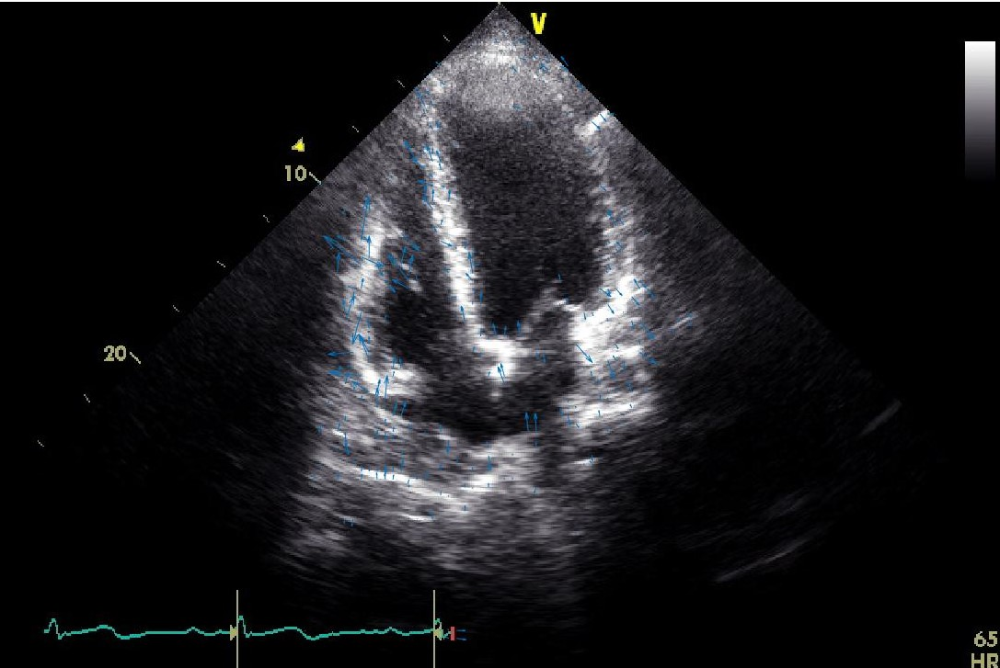
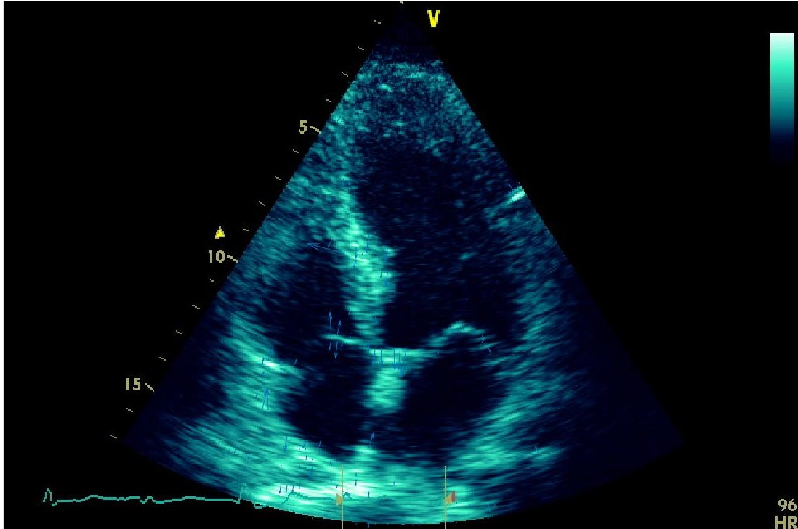

# Motion-estimation-in-Echocardiography

Myocardial infarction (MI), known also as heart attack, is a life-threatening worldwide health
problem. Mainly, MI happens due to a blockage or plaque in one or more arteries that feed/s the heart
muscle. By the time, cardiac cells cannot get enough oxygen because of the blocked artery, and they
start to die. The death of the cardiac cells accumulates, and at the end, MI happens.

Echocardiography (echo) is a non-invasive imaging technique that can monitor the heart in real time
from different views using ultrasound technology. Figure 1 shows an example echo image where the
bright pixels represent the heart muscle and the dark pixels inside the heart sections (right/ left
ventricle and right/ left atrium) are blood. Cardiologists decide on the possibility of MI by examining
the motion of the left ventricle wall in echo videos (see Figure 1). Therefore, in this exercise we need
to estimate the motion of echo videos and observe the results for left ventricle wall.


# Getting Started

  ## Pre-requisites
  
  * MATLAB
  * Git Desktop

  ## Steps

  1. Clone the repo
  2. Load the videos
  2. Run the MATLAB code

  ## 1. Clone the repo: 
  Clone the Image Processing repo locally. In a terminal, run:   
  
        ```
        $ git clone https://github.com/GaurangSharma18/Image-Processing.git
        $ cd Image-Processing
        $ git pull
        ```
  
  ## 2. Load the videos  
        The provided echo1.avi and echo2.avi contain echo videos for two different subjects. One of the
        videos shows a healthy heart echo while the other depicts an unhealthy one.
        
  ## 3. Run the Application  
        Open the file in MATLAB and click on Run.

# Motion Estimation of Echo1 Video
## Focus on the left ventricle in dedection of heart attack in these vedios. Please watch the arrows.

### Echo 1
<div float="left">
   
</div>


### Echo 2
<div float="left">
   
</div>
